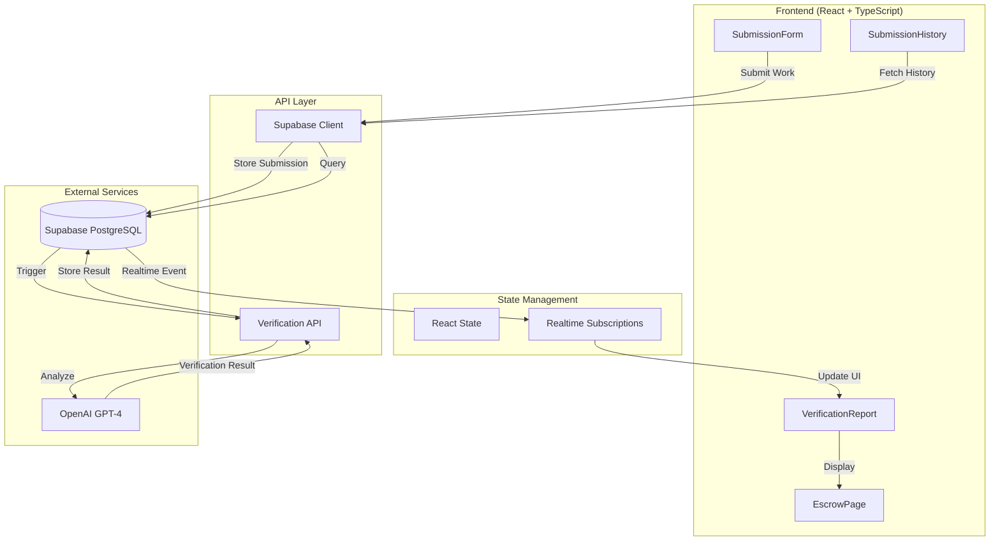
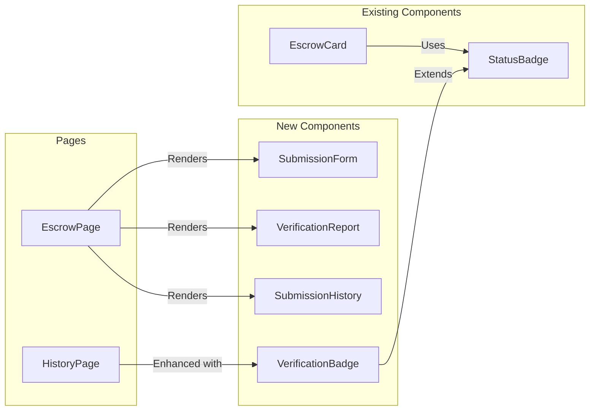

# Design Document: AI-Powered Delivery Verification

## Overview

This design document specifies the architecture and implementation approach for adding AI-powered verification of freelancer work deliverables to the MilestoneEscrow application. The feature enables freelancers to submit proof of completed work for each milestone, which is then analyzed by OpenAI's GPT-4 to provide objective verification scores and recommendations to clients before payment release.

### Goals

- Enable freelancers to submit work evidence (text descriptions + URLs) for milestone completion
- Provide AI-powered analysis comparing submissions against milestone requirements
- Generate verification scores (0-100) and actionable recommendations (approve/reject/request_changes)
- Maintain complete audit trail of all submissions and verifications
- Integrate seamlessly with existing escrow payment release flow
- Support real-time notifications for submission and verification events

### Non-Goals

- Automated payment release based on AI recommendations (AI is advisory only)
- File upload/storage for work deliverables (URLs only)
- Multi-language support for verification prompts (English only initially)
- Dispute resolution workflow (future enhancement)

## Architecture

### High-Level Architecture



### Component Architecture



### Data Flow

1. **Submission Flow**:
   - Freelancer fills SubmissionForm with description + URLs
   - Form validates input (character limits, URL format)
   - Submission stored in `work_submissions` table
   - Realtime event triggers verification process
   - AI analysis performed via OpenAI API
   - Verification result stored in `delivery_verifications` table
   - Realtime event updates UI with verification report

2. **Verification Flow**:
   - Extract milestone requirements from escrow record
   - Construct verification prompt with requirements + submission
   - Call OpenAI API with structured prompt
   - Parse JSON response (score, feedback, recommendation, gaps)
   - Cache result in memory for repeated views
   - Store result in database for audit trail

3. **Payment Release Flow**:
   - Client views escrow with pending milestone
   - Latest verification report displayed (if exists)
   - Warning shown if no submission exists
   - Confirmation dialog for "reject" recommendations
   - Client proceeds with payment release (AI is advisory)
   - Record which verification was displayed at release time

## Components and Interfaces

### React Components

#### SubmissionForm Component

**Purpose**: Allow freelancers to submit work evidence for milestone completion

**Props**:
```typescript
interface SubmissionFormProps {
  escrowId: string;
  milestoneIndex: number;
  milestoneName: string;
  milestoneDescription: string;
  onSubmitSuccess: (submission: WorkSubmission) => void;
  onSubmitError: (error: Error) => void;
}
```

**State**:
```typescript
interface SubmissionFormState {
  description: string;
  urls: string[];
  isSubmitting: boolean;
  validationErrors: {
    description?: string;
    urls?: string[];
  };
}
```

**Key Features**:
- Text area for description (max 2000 characters with counter)
- Dynamic URL input fields (up to 5 URLs)
- Real-time validation with error messages
- Loading state during submission
- Success confirmation with submission ID
- Integration with existing Tailwind CSS theme

#### VerificationReport Component

**Purpose**: Display AI verification results in a clear, actionable format

**Props**:
```typescript
interface VerificationReportProps {
  verification: DeliveryVerification;
  submission: WorkSubmission;
  showFullSubmission?: boolean;
}
```

**Visual Design**:
- Score displayed as circular progress indicator (0-100)
- Color-coded recommendation badge:
  - Green (approve): score >= 80
  - Yellow (request_changes): score 50-79
  - Red (reject): score < 50
- Feedback text in readable paragraph format
- Gaps displayed as bulleted list (when present)
- Timestamp in relative format ("2 hours ago")
- Expandable section to view full submission content

#### SubmissionHistory Component

**Purpose**: Display chronological list of all submissions and verifications for a milestone

**Props**:
```typescript
interface SubmissionHistoryProps {
  escrowId: string;
  milestoneIndex: number;
  onSelectSubmission?: (submission: WorkSubmission) => void;
}
```

**State**:
```typescript
interface SubmissionHistoryState {
  submissions: WorkSubmission[];
  verifications: Map<string, DeliveryVerification>;
  selectedSubmissionId: string | null;
  isLoading: boolean;
}
```

**Key Features**:
- List view with submission cards
- Each card shows: timestamp, score, recommendation badge
- "Most Recent" indicator on latest submission
- Click to expand full details
- Empty state message when no submissions exist
- Loading skeleton during data fetch

#### VerificationBadge Component

**Purpose**: Compact visual indicator of verification status for use in EscrowCard and HistoryPage

**Props**:
```typescript
interface VerificationBadgeProps {
  score: number;
  recommendation: 'approve' | 'request_changes' | 'reject';
  size?: 'small' | 'medium' | 'large';
}
```

**Visual Design**:
- Small circular badge with score
- Color matches recommendation
- Tooltip on hover showing recommendation text
- Responsive sizing for different contexts

### API Functions

#### Submission API (`frontend/src/api/submissions.ts`)

```typescript
/**
 * Submit work evidence for a milestone
 */
export async function submitWork(params: {
  escrowId: string;
  milestoneIndex: number;
  submitterAddress: string;
  description: string;
  urls: string[];
}): Promise<WorkSubmission>;

/**
 * Fetch all submissions for a specific milestone
 */
export async function fetchMilestoneSubmissions(
  escrowId: string,
  milestoneIndex: number
): Promise<WorkSubmission[]>;

/**
 * Fetch a single submission by ID
 */
export async function fetchSubmissionById(
  submissionId: string
): Promise<WorkSubmission | null>;
```

#### Verification API (`frontend/src/api/verifications.ts`)

```typescript
/**
 * Trigger AI verification for a work submission
 */
export async function verifySubmission(
  submissionId: string
): Promise<DeliveryVerification>;

/**
 * Fetch verification result for a submission
 */
export async function fetchVerification(
  submissionId: string
): Promise<DeliveryVerification | null>;

/**
 * Fetch verification with caching
 */
export async function fetchVerificationCached(
  submissionId: string
): Promise<DeliveryVerification | null>;

/**
 * Clear verification cache
 */
export function clearVerificationCache(): void;
```

#### Integration with Existing Code

**Extend `frontend/src/supabase.ts`**:
```typescript
// Add new interfaces
export interface WorkSubmission {
  id: string;
  created_at: string;
  escrow_id: string;
  milestone_index: number;
  submitter_address: string;
  description: string;
  urls: string[];
}

export interface DeliveryVerification {
  id: string;
  created_at: string;
  submission_id: string;
  score: number;
  recommendation: 'approve' | 'request_changes' | 'reject';
  feedback: string;
  gaps: string[] | null;
  raw_response: Record<string, unknown>;
}

// Add to Database schema types
export interface Database {
  public: {
    Tables: {
      escrows: { /* existing */ };
      work_submissions: {
        Row: WorkSubmission;
        Insert: Omit<WorkSubmission, 'id' | 'created_at'>;
        Update: Partial<Omit<WorkSubmission, 'id' | 'created_at'>>;
      };
      delivery_verifications: {
        Row: DeliveryVerification;
        Insert: Omit<DeliveryVerification, 'id' | 'created_at'>;
        Update: Partial<Omit<DeliveryVerification, 'id' | 'created_at'>>;
      };
    };
  };
}
```

**Extend `frontend/src/verification.ts`**:
- Rename existing `verifyMilestones` to `verifyMilestoneGeneration` for clarity
- Add new `verifyWorkSubmission` function for delivery verification
- Reuse caching pattern from existing code
- Maintain consistent error handling approach

**Enhance `frontend/src/pages/HistoryPage.tsx`**:
- Add verification badge to EscrowCard display
- Show latest verification score for each escrow
- Add filter option for "Needs Review" (submissions with reject/request_changes)

## Data Models

### Database Schema

#### work_submissions Table

```sql
CREATE TABLE work_submissions (
  -- Primary key and timestamps
  id UUID PRIMARY KEY DEFAULT gen_random_uuid(),
  created_at TIMESTAMPTZ NOT NULL DEFAULT NOW(),
  
  -- Foreign keys
  escrow_id UUID NOT NULL REFERENCES escrows(id) ON DELETE CASCADE,
  milestone_index INTEGER NOT NULL CHECK (milestone_index >= 0),
  
  -- Submitter info
  submitter_address TEXT NOT NULL,
  
  -- Submission content
  description TEXT NOT NULL CHECK (char_length(description) <= 2000),
  urls TEXT[] NOT NULL DEFAULT '{}' CHECK (array_length(urls, 1) IS NULL OR array_length(urls, 1) <= 5),
  
  -- Constraints
  CONSTRAINT unique_escrow_milestone_submission UNIQUE (escrow_id, milestone_index, created_at)
);

-- Indexes
CREATE INDEX idx_work_submissions_escrow_id ON work_submissions(escrow_id);
CREATE INDEX idx_work_submissions_milestone ON work_submissions(escrow_id, milestone_index);
CREATE INDEX idx_work_submissions_created_at ON work_submissions(created_at DESC);

-- RLS Policies
ALTER TABLE work_submissions ENABLE ROW LEVEL SECURITY;

CREATE POLICY "Users can view submissions for their escrows"
  ON work_submissions FOR SELECT
  USING (
    EXISTS (
      SELECT 1 FROM escrows
      WHERE escrows.id = work_submissions.escrow_id
      AND escrows.user_id = auth.uid()
    )
  );

CREATE POLICY "Users can insert submissions for their escrows"
  ON work_submissions FOR INSERT
  WITH CHECK (
    EXISTS (
      SELECT 1 FROM escrows
      WHERE escrows.id = work_submissions.escrow_id
      AND escrows.user_id = auth.uid()
    )
  );
```

#### delivery_verifications Table

```sql
CREATE TABLE delivery_verifications (
  -- Primary key and timestamps
  id UUID PRIMARY KEY DEFAULT gen_random_uuid(),
  created_at TIMESTAMPTZ NOT NULL DEFAULT NOW(),
  
  -- Foreign key
  submission_id UUID NOT NULL REFERENCES work_submissions(id) ON DELETE CASCADE,
  
  -- Verification results
  score INTEGER NOT NULL CHECK (score >= 0 AND score <= 100),
  recommendation TEXT NOT NULL CHECK (recommendation IN ('approve', 'request_changes', 'reject')),
  feedback TEXT NOT NULL,
  gaps TEXT[],
  
  -- Audit trail
  raw_response JSONB NOT NULL,
  
  -- One verification per submission
  CONSTRAINT unique_submission_verification UNIQUE (submission_id)
);

-- Indexes
CREATE INDEX idx_delivery_verifications_submission_id ON delivery_verifications(submission_id);
CREATE INDEX idx_delivery_verifications_score ON delivery_verifications(score);
CREATE INDEX idx_delivery_verifications_recommendation ON delivery_verifications(recommendation);

-- RLS Policies
ALTER TABLE delivery_verifications ENABLE ROW LEVEL SECURITY;

CREATE POLICY "Users can view verifications for their escrow submissions"
  ON delivery_verifications FOR SELECT
  USING (
    EXISTS (
      SELECT 1 FROM work_submissions
      JOIN escrows ON escrows.id = work_submissions.escrow_id
      WHERE work_submissions.id = delivery_verifications.submission_id
      AND escrows.user_id = auth.uid()
    )
  );

CREATE POLICY "System can insert verifications"
  ON delivery_verifications FOR INSERT
  WITH CHECK (true);
```

### TypeScript Interfaces

```typescript
// Work Submission
export interface WorkSubmission {
  id: string;
  created_at: string;
  escrow_id: string;
  milestone_index: number;
  submitter_address: string;
  description: string;
  urls: string[];
}

export interface WorkSubmissionInsert {
  escrow_id: string;
  milestone_index: number;
  submitter_address: string;
  description: string;
  urls: string[];
}

// Delivery Verification
export interface DeliveryVerification {
  id: string;
  created_at: string;
  submission_id: string;
  score: number;
  recommendation: 'approve' | 'request_changes' | 'reject';
  feedback: string;
  gaps: string[] | null;
  raw_response: Record<string, unknown>;
}

export interface DeliveryVerificationInsert {
  submission_id: string;
  score: number;
  recommendation: 'approve' | 'request_changes' | 'reject';
  feedback: string;
  gaps: string[] | null;
  raw_response: Record<string, unknown>;
}

// Combined view for UI
export interface SubmissionWithVerification {
  submission: WorkSubmission;
  verification: DeliveryVerification | null;
}
```

### Validation Rules

**Work Submission Validation**:
- `description`: Required, 1-2000 characters
- `urls`: Optional array, 0-5 valid URLs
- URL format: Must match regex `^https?://[^\s]+$`
- `milestone_index`: Must be valid index for the escrow's milestones array
- `submitter_address`: Must be valid Stellar public key format

**Delivery Verification Validation**:
- `score`: Integer 0-100
- `recommendation`: Must be 'approve', 'request_changes', or 'reject'
- `feedback`: Required, non-empty string
- `gaps`: Optional array of strings
- Score-recommendation consistency:
  - score >= 80 → recommendation should be 'approve'
  - score 50-79 → recommendation should be 'request_changes'
  - score < 50 → recommendation should be 'reject'

## State Management

### React State Strategy

**Local Component State**:
- Form input values (SubmissionForm)
- UI state (loading, errors, expanded sections)
- Temporary validation errors

**Lifted State** (in EscrowPage):
- Current escrow data
- Submissions for current milestone
- Latest verification result
- Realtime subscription status

**No Global State Library Needed**:
- Feature is scoped to individual escrow pages
- Data fetched on-demand when viewing escrow
- Realtime updates handled via Supabase subscriptions
- Caching handled at API layer (not UI layer)

### Realtime Subscriptions

**Subscription Setup** (in EscrowPage):
```typescript
useEffect(() => {
  if (!escrowId) return;
  
  // Subscribe to work submissions
  const submissionChannel = supabase
    .channel('work_submissions')
    .on(
      'postgres_changes',
      {
        event: 'INSERT',
        schema: 'public',
        table: 'work_submissions',
        filter: `escrow_id=eq.${escrowId}`,
      },
      (payload) => {
        handleNewSubmission(payload.new as WorkSubmission);
      }
    )
    .subscribe();
  
  // Subscribe to delivery verifications
  const verificationChannel = supabase
    .channel('delivery_verifications')
    .on(
      'postgres_changes',
      {
        event: 'INSERT',
        schema: 'public',
        table: 'delivery_verifications',
      },
      (payload) => {
        handleNewVerification(payload.new as DeliveryVerification);
      }
    )
    .subscribe();
  
  return () => {
    submissionChannel.unsubscribe();
    verificationChannel.unsubscribe();
  };
}, [escrowId]);
```

### Caching Strategy

**In-Memory Cache** (similar to existing `verification.ts`):
```typescript
const verificationCache = new Map<string, DeliveryVerification>();

export async function fetchVerificationCached(
  submissionId: string
): Promise<DeliveryVerification | null> {
  // Check cache first
  if (verificationCache.has(submissionId)) {
    console.log('Verification cache hit');
    return verificationCache.get(submissionId)!;
  }
  
  // Fetch from database
  const verification = await fetchVerification(submissionId);
  
  // Cache result
  if (verification) {
    verificationCache.set(submissionId, verification);
  }
  
  return verification;
}
```

**Cache Invalidation**:
- Clear cache when new submission created for same milestone
- Clear cache on page navigation
- Provide manual cache clear function for testing

## AI Verification Implementation

### Prompt Engineering

**Verification Prompt Template**:
```typescript
const buildVerificationPrompt = (
  milestone: Milestone,
  submission: WorkSubmission
): string => {
  return `You are an expert freelance project evaluator analyzing work deliverables.

MILESTONE REQUIREMENTS:
Name: ${milestone.name}
Description: ${milestone.description}
Acceptance Criteria: ${milestone.description}

FREELANCER SUBMISSION:
Description: ${submission.description}
${submission.urls.length > 0 ? `URLs Provided: ${submission.urls.join(', ')}` : 'No URLs provided'}

EVALUATION TASK:
Analyze if the submission adequately demonstrates completion of the milestone requirements.

EVALUATION CRITERIA:
1. Completeness: Does the submission address all aspects of the milestone?
2. Relevance: Is the submitted work directly related to the milestone requirements?
3. Quality: Does the submission demonstrate professional-quality work?
4. Evidence: Are the provided URLs and description sufficient proof of completion?

Return ONLY valid JSON in this exact format:
{
  "score": 0-100,
  "recommendation": "approve" | "request_changes" | "reject",
  "feedback": "2-3 sentence explanation of the score",
  "gaps": ["specific missing element 1", "specific missing element 2"]
}

SCORING GUIDELINES:
- 80-100: Excellent - clearly meets all requirements
- 50-79: Partial - meets some requirements but has gaps
- 0-49: Insufficient - does not adequately demonstrate completion

RECOMMENDATION GUIDELINES:
- "approve": score >= 80, work clearly meets requirements
- "request_changes": score 50-79, work is partially complete
- "reject": score < 50, work does not meet requirements

Note: Only include "gaps" array if score < 80. Each gap should be specific and actionable.`;
};
```

### API Integration

**Verification Function** (`frontend/src/api/verifications.ts`):
```typescript
export async function verifyWorkSubmission(
  submission: WorkSubmission,
  milestone: Milestone
): Promise<DeliveryVerification> {
  const OPENAI_API_KEY = import.meta.env.VITE_OPENAI_API_KEY;
  
  // Handle missing API key
  if (!OPENAI_API_KEY || OPENAI_API_KEY === "YOUR_OPENAI_API_KEY_HERE") {
    throw new Error('OpenAI API key not configured');
  }
  
  const prompt = buildVerificationPrompt(milestone, submission);
  
  try {
    const response = await fetch("https://api.openai.com/v1/chat/completions", {
      method: "POST",
      headers: {
        "Content-Type": "application/json",
        Authorization: `Bearer ${OPENAI_API_KEY}`,
      },
      body: JSON.stringify({
        model: "gpt-4o-mini",
        messages: [{ role: "user", content: prompt }],
        temperature: 0.3,
        max_tokens: 500,
      }),
    });
    
    if (!response.ok) {
      throw new Error(`OpenAI API error: ${response.status}`);
    }
    
    const data = await response.json();
    const text = data.choices[0].message.content
      .replace(/```json|```/g, "")
      .trim();
    
    const parsed = JSON.parse(text);
    
    // Validate response structure
    validateVerificationResponse(parsed);
    
    // Store in database
    const verification = await insertVerification({
      submission_id: submission.id,
      score: parsed.score,
      recommendation: parsed.recommendation,
      feedback: parsed.feedback,
      gaps: parsed.gaps || null,
      raw_response: data,
    });
    
    return verification;
  } catch (error) {
    console.error('Verification error:', error);
    throw error;
  }
}

function validateVerificationResponse(response: any): void {
  if (typeof response.score !== 'number' || response.score < 0 || response.score > 100) {
    throw new Error('Invalid score in verification response');
  }
  
  if (!['approve', 'request_changes', 'reject'].includes(response.recommendation)) {
    throw new Error('Invalid recommendation in verification response');
  }
  
  if (typeof response.feedback !== 'string' || response.feedback.length === 0) {
    throw new Error('Invalid feedback in verification response');
  }
  
  // Validate score-recommendation consistency
  if (response.score >= 80 && response.recommendation !== 'approve') {
    console.warn('Score-recommendation mismatch: high score but not approved');
  }
  if (response.score < 50 && response.recommendation !== 'reject') {
    console.warn('Score-recommendation mismatch: low score but not rejected');
  }
}
```

### Error Handling

**API Error Scenarios**:
1. **OpenAI API Unavailable**: Display user-friendly message, allow manual review
2. **Invalid API Response**: Log error, retry once, then fail gracefully
3. **Database Storage Failure**: Retry with exponential backoff (reuse existing pattern)
4. **Network Timeout**: Set 10-second timeout, display timeout message

**User-Facing Error Messages**:
- "Verification temporarily unavailable. Please try again in a few moments."
- "Unable to analyze submission. You can still review manually."
- "Verification in progress. This may take up to 10 seconds."

## Integration with Payment Release Flow

### Enhanced EscrowPage

**Display Verification Status**:
```typescript
// In milestone display section
{milestone.hasSubmission && (
  <VerificationBadge
    score={latestVerification.score}
    recommendation={latestVerification.recommendation}
  />
)}

{!milestone.hasSubmission && milestone.status === 'active' && (
  <div className="text-xs text-yellow-600">
    ⚠️ No work submitted yet
  </div>
)}
```

**Payment Release Confirmation**:
```typescript
const handleReleasePayment = async (milestoneIndex: number) => {
  const latestVerification = await fetchLatestVerification(escrowId, milestoneIndex);
  
  // Warning if no submission
  if (!latestVerification) {
    const confirmed = window.confirm(
      'No work has been submitted for this milestone. Are you sure you want to release payment?'
    );
    if (!confirmed) return;
  }
  
  // Confirmation for reject recommendation
  if (latestVerification?.recommendation === 'reject') {
    const confirmed = window.confirm(
      `AI verification recommends rejecting this submission (score: ${latestVerification.score}/100). Are you sure you want to release payment?`
    );
    if (!confirmed) return;
  }
  
  // Record which verification was displayed
  await recordPaymentRelease(escrowId, milestoneIndex, latestVerification?.id);
  
  // Proceed with existing payment release flow
  await releasePaymentToBlockchain(escrowId, milestoneIndex);
};
```

### Audit Trail

**Track Payment Decisions**:
```sql
-- Add column to escrows table
ALTER TABLE escrows ADD COLUMN payment_releases JSONB DEFAULT '[]';

-- Structure:
-- [
--   {
--     "milestone_index": 0,
--     "released_at": "2024-01-15T10:30:00Z",
--     "verification_id": "uuid",
--     "verification_score": 85,
--     "verification_recommendation": "approve"
--   }
-- ]
```

This provides complete audit trail showing:
- Which verification was displayed when payment was released
- Whether client followed or overrode AI recommendation
- Timestamp of payment release decision

