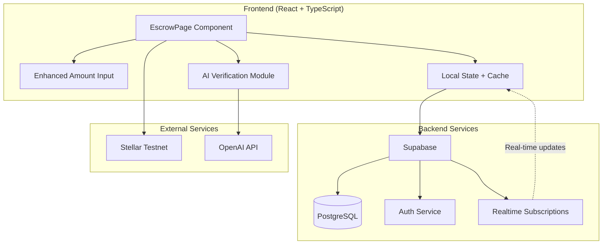
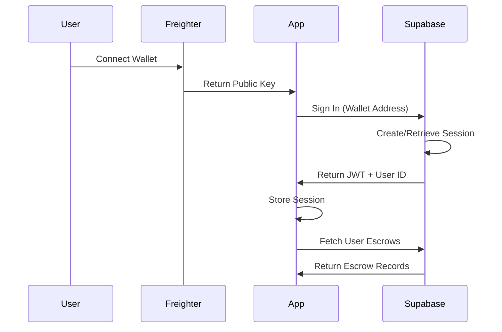
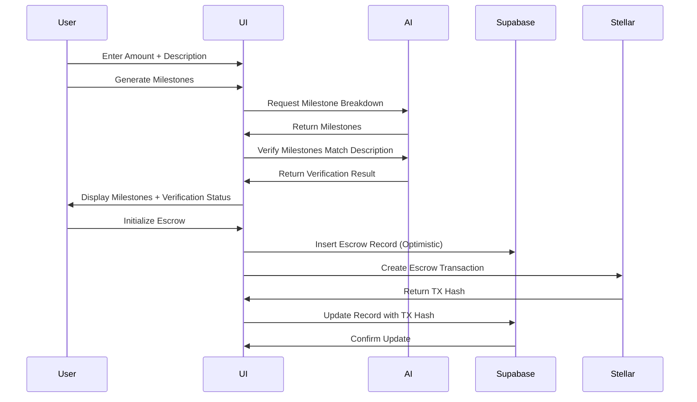

# Design Document: Enhanced Amount Input

## Overview

This design enhances the Stellar escrow application with three major improvements: (1) text-based amount input replacing spinner controls, (2) Supabase backend integration for persistent data storage, and (3) AI-powered milestone verification. The design focuses on maintaining the existing UI aesthetic while adding robust data persistence, real-time synchronization, and intelligent validation.

### Key Design Goals

- **Enhanced Input UX**: Replace number spinner with direct text input supporting keyboard entry, copy/paste, and proper validation
- **Backend Integration**: Implement Supabase for authentication, data persistence, and real-time updates
- **AI Verification**: Add intelligent validation layer to ensure generated milestones match project descriptions
- **Offline Resilience**: Support offline operation with automatic sync when connection restores
- **Performance**: Optimize for fast interactions with caching and optimistic updates

### Technology Stack

- **Frontend**: React 19.2.4 + TypeScript 6.0.2 + Vite 8.0.4
- **Backend**: Supabase (PostgreSQL + Auth + Realtime)
- **Blockchain**: Stellar SDK 12.0.0 (Testnet)
- **AI**: OpenAI API (gpt-4o-mini)
- **Testing**: Vitest + fast-check (property-based testing)

## Architecture

### System Architecture



### Authentication Flow



### Data Flow



## Components and Interfaces

### Enhanced Amount Input Component

**Location**: `frontend/src/pages/EscrowPage.tsx` (inline modification)

**Interface**:
```typescript
interface AmountInputProps {
  value: string;
  onChange: (value: string) => void;
  placeholder?: string;
  maxDecimals?: number;
}
```

**Behavior**:
- Accepts text input for numeric values
- Validates input in real-time (numeric + single decimal point)
- Limits decimal precision to 7 places (XLM standard)
- Sanitizes pasted content
- Maintains existing styling and accessibility

**Validation Logic**:
```typescript
const sanitizeAmountInput = (input: string): string => {
  // Remove non-numeric characters except decimal point
  let sanitized = input.replace(/[^\d.]/g, '');
  
  // Allow only one decimal point
  const parts = sanitized.split('.');
  if (parts.length > 2) {
    sanitized = parts[0] + '.' + parts.slice(1).join('');
  }
  
  // Limit to 7 decimal places
  if (parts.length === 2 && parts[1].length > 7) {
    sanitized = parts[0] + '.' + parts[1].substring(0, 7);
  }
  
  return sanitized;
};
```

### Supabase Client Module

**Location**: `frontend/src/supabase.ts` (new file)

**Interface**:
```typescript
import { createClient, SupabaseClient } from '@supabase/supabase-js';

interface Database {
  public: {
    Tables: {
      escrows: {
        Row: EscrowRecord;
        Insert: EscrowInsert;
        Update: EscrowUpdate;
      };
    };
  };
}

export const supabase: SupabaseClient<Database>;

export const authenticateWithWallet: (walletAddress: string) => Promise<AuthResponse>;
export const insertEscrow: (escrow: EscrowInsert) => Promise<EscrowRecord>;
export const updateEscrow: (id: string, updates: EscrowUpdate) => Promise<EscrowRecord>;
export const fetchUserEscrows: (userId: string) => Promise<EscrowRecord[]>;
export const subscribeToEscrows: (userId: string, callback: (escrow: EscrowRecord) => void) => RealtimeChannel;
```

### AI Verification Module

**Location**: `frontend/src/verification.ts` (new file)

**Interface**:
```typescript
export interface VerificationResult {
  status: 'matching' | 'partial' | 'not_matching' | 'error';
  confidence: number; // 0-100
  feedback: string;
  gaps?: string[]; // For partial matches
}

export const verifyMilestones = async (
  description: string,
  milestones: Milestone[]
): Promise<VerificationResult>;
```

**Verification Prompt Strategy**:
```typescript
const verificationPrompt = `
You are a project milestone verification expert.

Project Description: "${description}"

Generated Milestones:
${milestones.map((m, i) => `${i + 1}. ${m.name} (${m.percentage}%): ${m.description}`).join('\n')}

Analyze if the milestones comprehensively cover the project scope.

Return ONLY valid JSON:
{
  "status": "matching" | "partial" | "not_matching",
  "confidence": 0-100,
  "feedback": "brief explanation",
  "gaps": ["missing aspect 1", "missing aspect 2"] // only if partial/not_matching
}

Criteria:
- Do milestones cover all major deliverables mentioned?
- Are milestones specific to the project type?
- Is the breakdown logical and complete?
`;
```

## Data Models

### Supabase Database Schema

**Table: `escrows`**

```sql
CREATE TABLE escrows (
  id UUID PRIMARY KEY DEFAULT gen_random_uuid(),
  created_at TIMESTAMPTZ NOT NULL DEFAULT NOW(),
  updated_at TIMESTAMPTZ NOT NULL DEFAULT NOW(),
  
  -- User & Addresses
  user_id UUID NOT NULL REFERENCES auth.users(id) ON DELETE CASCADE,
  wallet_address TEXT NOT NULL,
  freelancer_address TEXT NOT NULL,
  
  -- Escrow Details
  amount NUMERIC(20, 7) NOT NULL CHECK (amount > 0),
  description TEXT NOT NULL,
  milestone_count INTEGER NOT NULL CHECK (milestone_count > 0),
  milestones JSONB NOT NULL,
  
  -- Transaction Info
  tx_hash TEXT,
  status TEXT NOT NULL DEFAULT 'pending' CHECK (status IN ('pending', 'active', 'completed', 'refunded')),
  
  -- AI Verification
  verification_result JSONB,
  
  -- Indexes
  CONSTRAINT escrows_wallet_address_idx ON escrows(wallet_address),
  CONSTRAINT escrows_created_at_idx ON escrows(created_at DESC),
  CONSTRAINT escrows_user_id_idx ON escrows(user_id)
);

-- Enable Row Level Security
ALTER TABLE escrows ENABLE ROW LEVEL SECURITY;

-- RLS Policies
CREATE POLICY "Users can view their own escrows"
  ON escrows FOR SELECT
  USING (auth.uid() = user_id);

CREATE POLICY "Users can insert their own escrows"
  ON escrows FOR INSERT
  WITH CHECK (auth.uid() = user_id);

CREATE POLICY "Users can update their own escrows"
  ON escrows FOR UPDATE
  USING (auth.uid() = user_id);

-- Trigger for updated_at
CREATE OR REPLACE FUNCTION update_updated_at_column()
RETURNS TRIGGER AS $$
BEGIN
  NEW.updated_at = NOW();
  RETURN NEW;
END;
$$ LANGUAGE plpgsql;

CREATE TRIGGER update_escrows_updated_at
  BEFORE UPDATE ON escrows
  FOR EACH ROW
  EXECUTE FUNCTION update_updated_at_column();
```

### TypeScript Interfaces

```typescript
export interface EscrowRecord {
  id: string;
  created_at: string;
  updated_at: string;
  user_id: string;
  wallet_address: string;
  freelancer_address: string;
  amount: number;
  description: string;
  milestone_count: number;
  milestones: Milestone[];
  tx_hash: string | null;
  status: 'pending' | 'active' | 'completed' | 'refunded';
  verification_result: VerificationResult | null;
}

export interface EscrowInsert {
  user_id: string;
  wallet_address: string;
  freelancer_address: string;
  amount: number;
  description: string;
  milestone_count: number;
  milestones: Milestone[];
  verification_result?: VerificationResult;
}

export interface EscrowUpdate {
  tx_hash?: string;
  status?: 'pending' | 'active' | 'completed' | 'refunded';
  verification_result?: VerificationResult;
}

export interface Milestone {
  name: string;
  description: string;
  percentage: number;
  xlm: number;
}
```

### Local Storage Schema (Offline Support)

```typescript
interface OfflineEscrow extends EscrowInsert {
  offline_id: string;
  created_at: string;
  synced: boolean;
}

// localStorage key: 'escrow_offline_queue'
```

## Error Handling

### Error Categories

1. **Input Validation Errors**
   - Invalid amount format
   - Amount <= 0
   - Missing required fields
   - Handled: Client-side validation with visual feedback

2. **Network Errors**
   - Supabase connection failure
   - OpenAI API timeout
   - Stellar RPC unavailable
   - Handled: Retry logic + offline mode + user notification

3. **Authentication Errors**
   - Wallet not connected
   - Supabase session expired
   - Invalid JWT
   - Handled: Redirect to auth flow + session refresh

4. **Database Errors**
   - Insert/update failure
   - RLS policy violation
   - Constraint violation
   - Handled: Rollback optimistic update + error message

5. **Blockchain Errors**
   - Transaction rejected
   - Insufficient balance
   - Contract error
   - Handled: Revert UI state + detailed error message

### Error Handling Strategy

```typescript
class EscrowError extends Error {
  constructor(
    message: string,
    public code: string,
    public recoverable: boolean,
    public userMessage: string
  ) {
    super(message);
  }
}

const handleError = (error: unknown): EscrowError => {
  if (error instanceof EscrowError) return error;
  
  // Network errors
  if (error instanceof TypeError && error.message.includes('fetch')) {
    return new EscrowError(
      'Network request failed',
      'NETWORK_ERROR',
      true,
      'Connection lost. Your data is saved locally and will sync when online.'
    );
  }
  
  // Supabase errors
  if (error && typeof error === 'object' && 'code' in error) {
    const code = (error as any).code;
    if (code === 'PGRST301') {
      return new EscrowError(
        'RLS policy violation',
        'AUTH_ERROR',
        false,
        'Authentication required. Please reconnect your wallet.'
      );
    }
  }
  
  // Default
  return new EscrowError(
    String(error),
    'UNKNOWN_ERROR',
    false,
    'An unexpected error occurred. Please try again.'
  );
};
```

### Retry Logic

```typescript
const retryWithBackoff = async <T>(
  fn: () => Promise<T>,
  maxRetries: number = 3,
  baseDelay: number = 1000
): Promise<T> => {
  for (let i = 0; i < maxRetries; i++) {
    try {
      return await fn();
    } catch (error) {
      if (i === maxRetries - 1) throw error;
      
      const delay = baseDelay * Math.pow(2, i);
      await new Promise(resolve => setTimeout(resolve, delay));
    }
  }
  throw new Error('Max retries exceeded');
};
```

## Testing Strategy

### Unit Testing Approach

**Test Framework**: Vitest
**Coverage Target**: 80% for business logic

**Unit Test Categories**:

1. **Input Validation Tests**
   - Valid numeric input acceptance
   - Invalid character rejection
   - Decimal point handling
   - Paste sanitization
   - Edge cases (empty, zero, negative)

2. **Data Transformation Tests**
   - Amount formatting (display vs. storage)
   - Milestone calculation accuracy
   - JSON serialization/deserialization

3. **Error Handling Tests**
   - Error classification
   - User message generation
   - Retry logic behavior

4. **Integration Tests**
   - Supabase client operations (with mocks)
   - OpenAI API calls (with mocks)
   - Stellar transaction building (with mocks)

**Example Unit Test**:
```typescript
describe('sanitizeAmountInput', () => {
  it('should remove non-numeric characters', () => {
    expect(sanitizeAmountInput('abc123')).toBe('123');
  });
  
  it('should allow single decimal point', () => {
    expect(sanitizeAmountInput('12.34')).toBe('12.34');
  });
  
  it('should remove extra decimal points', () => {
    expect(sanitizeAmountInput('12.34.56')).toBe('12.3456');
  });
  
  it('should limit to 7 decimal places', () => {
    expect(sanitizeAmountInput('1.12345678')).toBe('1.1234567');
  });
});
```

### Property-Based Testing Approach

**Test Framework**: fast-check
**Minimum Iterations**: 100 per property

This feature is suitable for property-based testing because it involves:
- Data transformation (amount formatting, milestone calculations)
- Input validation with universal rules
- Serialization/deserialization (JSON, database)

**Property Test Strategy**:
- Use fast-check generators for random test data
- Verify universal properties across all valid inputs
- Test round-trip transformations
- Validate invariants after operations


## Correctness Properties

*A property is a characteristic or behavior that should hold true across all valid executions of a system—essentially, a formal statement about what the system should do. Properties serve as the bridge between human-readable specifications and machine-verifiable correctness guarantees.*

### Property 1: Input Sanitization Produces Valid Numeric Format

*For any* input string (typed or pasted), the sanitization function SHALL produce a string that:
- Contains only digits and at most one decimal point
- Has at most 7 digits after the decimal point
- Has the first decimal point preserved if multiple exist
- Has all non-numeric characters (except '.') removed

**Validates: Requirements 2.1, 2.2, 3.1, 4.4**

### Property 2: Display Formatting Consistency

*For any* valid numeric amount value, when formatted for display in the Transaction Summary, the output SHALL:
- Contain exactly 2 digits after the decimal point
- Be a valid numeric string parseable by parseFloat
- Preserve the integer part unchanged

**Validates: Requirements 3.2**

### Property 3: Full Precision Preservation in Data Flow

*For any* valid amount with up to 7 decimal places, when passed to external systems (Milestone Generator or blockchain transaction), the value SHALL:
- Maintain all decimal places from the original input
- Be numerically equal to the original value when parsed
- Not introduce rounding errors

**Validates: Requirements 3.3, 3.4**

### Property 4: Status Filtering Correctness

*For any* collection of escrow records and any status filter value, the filtered results SHALL:
- Contain only records matching the specified status
- Contain all records matching the specified status (no false negatives)
- Preserve the original order of matching records

**Validates: Requirements 10.6**

### Property 5: Offline Sync Completeness

*For any* set of offline escrow records stored in localStorage, when connection is restored and sync is triggered, the system SHALL:
- Upload all offline records to Supabase
- Mark all successfully uploaded records as synced
- Preserve all record data without loss during upload
- Remove successfully synced records from offline queue

**Validates: Requirements 11.3**


### Property-Based Test Implementation

**Library**: fast-check (npm package)
**Configuration**: Minimum 100 iterations per property test

**Property Test Examples**:

```typescript
import fc from 'fast-check';
import { describe, it } from 'vitest';
import { sanitizeAmountInput, formatDisplayAmount } from './amount-utils';

describe('Property 1: Input Sanitization', () => {
  it('should produce valid numeric format for any input', () => {
    fc.assert(
      fc.property(fc.string(), (input) => {
        const result = sanitizeAmountInput(input);
        
        // Should only contain digits and at most one decimal point
        const validPattern = /^\d*\.?\d*$/;
        expect(result).toMatch(validPattern);
        
        // Should have at most one decimal point
        const decimalCount = (result.match(/\./g) || []).length;
        expect(decimalCount).toBeLessThanOrEqual(1);
        
        // Should have at most 7 decimal places
        const parts = result.split('.');
        if (parts.length === 2) {
          expect(parts[1].length).toBeLessThanOrEqual(7);
        }
      }),
      { numRuns: 100 }
    );
  });
  
  // Feature: enhanced-amount-input, Property 1: Input sanitization produces valid numeric format
});

describe('Property 2: Display Formatting Consistency', () => {
  it('should format any valid amount to exactly 2 decimal places', () => {
    fc.assert(
      fc.property(
        fc.double({ min: 0.0000001, max: 1000000, noNaN: true }),
        (amount) => {
          const formatted = formatDisplayAmount(amount);
          
          // Should have exactly 2 decimal places
          const parts = formatted.split('.');
          expect(parts).toHaveLength(2);
          expect(parts[1]).toHaveLength(2);
          
          // Should be parseable
          const parsed = parseFloat(formatted);
          expect(parsed).not.toBeNaN();
          
          // Should preserve integer part
          expect(Math.floor(parsed)).toBe(Math.floor(amount));
        }
      ),
      { numRuns: 100 }
    );
  });
  
  // Feature: enhanced-amount-input, Property 2: Display formatting consistency
});

describe('Property 3: Full Precision Preservation', () => {
  it('should preserve full precision when passing to external systems', () => {
    fc.assert(
      fc.property(
        fc.double({ min: 0.0000001, max: 1000000, noNaN: true })
          .map(n => parseFloat(n.toFixed(7))), // Limit to 7 decimals
        (amount) => {
          const amountString = amount.toString();
          
          // Simulate passing to milestone generator
          const milestoneAmount = parseFloat(amountString);
          expect(milestoneAmount).toBe(amount);
          
          // Simulate passing to blockchain
          const blockchainAmount = parseFloat(amountString);
          expect(blockchainAmount).toBe(amount);
        }
      ),
      { numRuns: 100 }
    );
  });
  
  // Feature: enhanced-amount-input, Property 3: Full precision preservation in data flow
});

describe('Property 4: Status Filtering Correctness', () => {
  it('should return only matching records for any status filter', () => {
    fc.assert(
      fc.property(
        fc.array(
          fc.record({
            id: fc.uuid(),
            status: fc.constantFrom('pending', 'active', 'completed', 'refunded'),
            amount: fc.double({ min: 1, max: 10000 })
          })
        ),
        fc.constantFrom('pending', 'active', 'completed', 'refunded'),
        (escrows, filterStatus) => {
          const filtered = escrows.filter(e => e.status === filterStatus);
          
          // All results should match filter
          expect(filtered.every(e => e.status === filterStatus)).toBe(true);
          
          // Should contain all matching records
          const expectedCount = escrows.filter(e => e.status === filterStatus).length;
          expect(filtered.length).toBe(expectedCount);
        }
      ),
      { numRuns: 100 }
    );
  });
  
  // Feature: enhanced-amount-input, Property 4: Status filtering correctness
});

describe('Property 5: Offline Sync Completeness', () => {
  it('should upload all offline records when sync is triggered', async () => {
    fc.assert(
      await fc.asyncProperty(
        fc.array(
          fc.record({
            offline_id: fc.uuid(),
            wallet_address: fc.hexaString({ minLength: 56, maxLength: 56 }),
            amount: fc.double({ min: 1, max: 10000 }),
            synced: fc.constant(false)
          }),
          { minLength: 1, maxLength: 10 }
        ),
        async (offlineEscrows) => {
          // Mock sync function
          const syncedIds = new Set<string>();
          const mockSync = async (escrow: any) => {
            syncedIds.add(escrow.offline_id);
            return { success: true };
          };
          
          // Sync all records
          for (const escrow of offlineEscrows) {
            await mockSync(escrow);
          }
          
          // All records should be synced
          expect(syncedIds.size).toBe(offlineEscrows.length);
          expect(offlineEscrows.every(e => syncedIds.has(e.offline_id))).toBe(true);
        }
      ),
      { numRuns: 100 }
    );
  });
  
  // Feature: enhanced-amount-input, Property 5: Offline sync completeness
});
```

### Integration Testing Strategy

**Integration Test Categories**:

1. **Supabase Integration Tests**
   - Authentication flow with wallet address
   - Escrow CRUD operations
   - Real-time subscription updates
   - RLS policy enforcement
   - Use Supabase local development environment or test project

2. **OpenAI Integration Tests**
   - Milestone generation with various descriptions
   - Verification analysis with different milestone sets
   - Error handling for API failures
   - Use mock responses for unit tests, real API for integration tests

3. **Stellar Integration Tests**
   - Transaction building with various amounts
   - Transaction signing flow
   - Transaction submission and confirmation
   - Use Stellar testnet for integration tests

**Integration Test Example**:
```typescript
describe('Supabase Escrow Operations', () => {
  it('should insert and retrieve escrow record', async () => {
    const testEscrow = {
      user_id: testUserId,
      wallet_address: testWalletAddress,
      freelancer_address: 'GTEST...',
      amount: 100.5,
      description: 'Test project',
      milestone_count: 3,
      milestones: mockMilestones,
    };
    
    const inserted = await insertEscrow(testEscrow);
    expect(inserted.id).toBeDefined();
    
    const fetched = await fetchUserEscrows(testUserId);
    expect(fetched).toContainEqual(expect.objectContaining(testEscrow));
  });
});
```

### End-to-End Testing Strategy

**E2E Test Scenarios**:

1. **Happy Path: Create Escrow with AI Verification**
   - Connect wallet
   - Enter amount, description, freelancer address
   - Generate milestones
   - Verify milestones match description
   - Initialize escrow
   - Verify escrow appears in history

2. **Offline Mode: Create Escrow Without Connection**
   - Disconnect network
   - Create escrow (stored locally)
   - Reconnect network
   - Verify escrow syncs to Supabase

3. **Error Recovery: Handle API Failures**
   - Trigger OpenAI API error
   - Verify graceful degradation
   - Verify user can still proceed

**E2E Test Tools**: Playwright or Cypress

## Performance Optimization

### Caching Strategy

```typescript
// In-memory cache for escrow data
const escrowCache = new Map<string, EscrowRecord[]>();

export const fetchUserEscrowsCached = async (userId: string): Promise<EscrowRecord[]> => {
  if (escrowCache.has(userId)) {
    return escrowCache.get(userId)!;
  }
  
  const escrows = await fetchUserEscrows(userId);
  escrowCache.set(userId, escrows);
  return escrows;
};

// Verification result cache
const verificationCache = new Map<string, VerificationResult>();

export const verifyMilestonesCached = async (
  description: string,
  milestones: Milestone[]
): Promise<VerificationResult> => {
  const cacheKey = `${description}:${JSON.stringify(milestones)}`;
  
  if (verificationCache.has(cacheKey)) {
    return verificationCache.get(cacheKey)!;
  }
  
  const result = await verifyMilestones(description, milestones);
  verificationCache.set(cacheKey, result);
  return result;
};
```

### Optimistic Updates

```typescript
export const createEscrowOptimistic = async (
  escrow: EscrowInsert,
  onOptimisticUpdate: (tempEscrow: EscrowRecord) => void
): Promise<EscrowRecord> => {
  // Create temporary record with optimistic ID
  const tempEscrow: EscrowRecord = {
    ...escrow,
    id: `temp-${Date.now()}`,
    created_at: new Date().toISOString(),
    updated_at: new Date().toISOString(),
    tx_hash: null,
    status: 'pending',
  };
  
  // Update UI immediately
  onOptimisticUpdate(tempEscrow);
  
  try {
    // Perform actual insert
    const inserted = await insertEscrow(escrow);
    return inserted;
  } catch (error) {
    // Rollback optimistic update on error
    throw error;
  }
};
```

### Database Indexing

```sql
-- Indexes for fast queries (already included in schema)
CREATE INDEX idx_escrows_wallet_address ON escrows(wallet_address);
CREATE INDEX idx_escrows_created_at ON escrows(created_at DESC);
CREATE INDEX idx_escrows_user_id ON escrows(user_id);
CREATE INDEX idx_escrows_status ON escrows(status);
```

### Async Verification

```typescript
export const handleMilestoneGeneration = async (
  description: string,
  amount: number,
  onMilestonesGenerated: (milestones: Milestone[]) => void,
  onVerificationComplete: (result: VerificationResult) => void
) => {
  // Generate milestones
  const milestones = await generateMilestones(description, amount);
  onMilestonesGenerated(milestones);
  
  // Verify asynchronously (non-blocking)
  verifyMilestonesCached(description, milestones)
    .then(onVerificationComplete)
    .catch(error => {
      console.error('Verification failed:', error);
      onVerificationComplete({
        status: 'error',
        confidence: 0,
        feedback: 'Verification unavailable'
      });
    });
};
```

## Security Considerations

### Input Validation

- **Client-side**: Sanitize all user inputs before processing
- **Server-side**: Supabase RLS policies enforce data access control
- **Blockchain**: Stellar SDK validates transaction parameters

### Authentication Security

- **Wallet-based auth**: No passwords stored, uses cryptographic signatures
- **Session management**: Supabase handles JWT tokens securely
- **RLS policies**: Ensure users can only access their own data

### Data Privacy

- **Encryption**: Supabase encrypts data at rest and in transit (TLS)
- **Access control**: RLS policies prevent unauthorized data access
- **API keys**: Stored in environment variables, never committed to code

### XSS Prevention

- **React**: Automatic escaping of user inputs in JSX
- **Sanitization**: All text inputs sanitized before display
- **CSP**: Consider adding Content Security Policy headers

## Deployment Considerations

### Environment Variables

```bash
# Frontend (.env)
VITE_SUPABASE_URL=https://your-project.supabase.co
VITE_SUPABASE_ANON_KEY=your-anon-key
VITE_OPENAI_API_KEY=your-openai-key
VITE_STELLAR_RPC_URL=https://soroban-testnet.stellar.org
VITE_CONTRACT_ID=your-contract-id
```

### Supabase Setup Steps

1. Create Supabase project
2. Run database migration to create `escrows` table
3. Enable RLS on `escrows` table
4. Create RLS policies for user access
5. Configure authentication settings
6. Add environment variables to frontend

### Database Migration

```sql
-- migrations/001_create_escrows_table.sql
-- (Schema already defined in Data Models section)
```

### Monitoring and Logging

- **Frontend errors**: Log to console + optional error tracking service
- **Supabase operations**: Monitor via Supabase dashboard
- **API usage**: Track OpenAI API usage and costs
- **Performance**: Monitor page load times and API response times

## Future Enhancements

### Potential Improvements

1. **Batch Operations**: Support creating multiple escrows at once
2. **Advanced Filtering**: Add more filter options (date range, amount range)
3. **Export Functionality**: Export escrow history to CSV/PDF
4. **Notifications**: Real-time notifications for escrow status changes
5. **Multi-language Support**: Internationalization for global users
6. **Mobile App**: React Native version with same backend
7. **Analytics Dashboard**: Visualize escrow statistics and trends

### Scalability Considerations

- **Database**: Supabase scales automatically with usage
- **Caching**: Implement Redis for high-traffic scenarios
- **CDN**: Use CDN for static assets
- **Rate Limiting**: Add rate limiting for API endpoints

## Conclusion

This design provides a comprehensive approach to enhancing the escrow application with improved input handling, persistent backend storage, and intelligent AI verification. The architecture maintains separation of concerns, supports offline operation, and ensures data security through RLS policies. Property-based testing ensures correctness across a wide range of inputs, while integration tests verify end-to-end functionality.

The implementation follows React best practices, leverages Supabase for backend services, and integrates seamlessly with the existing Stellar blockchain infrastructure. The design is extensible and can accommodate future enhancements without major refactoring.
