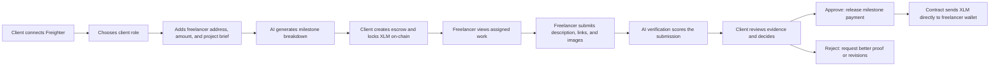
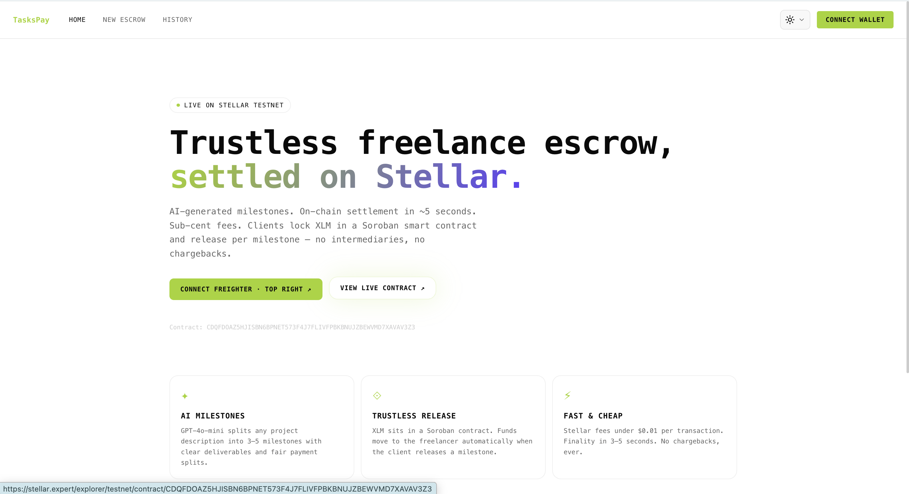
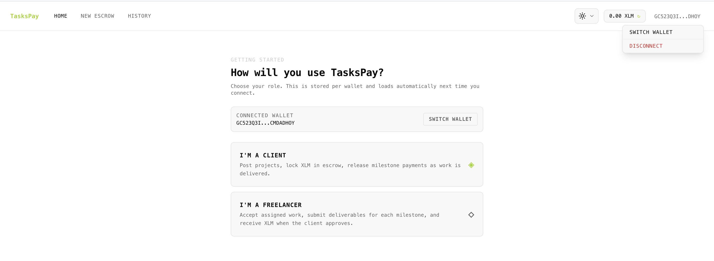
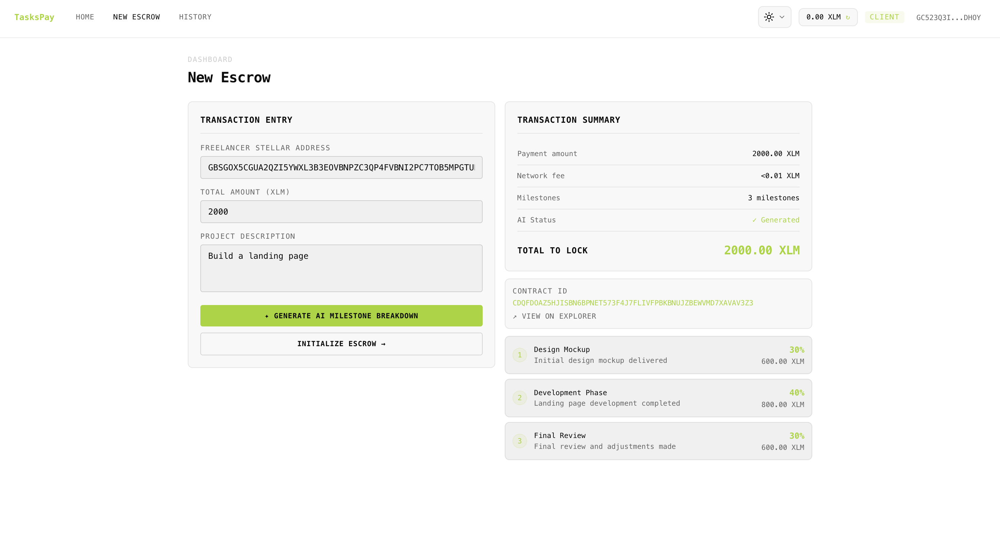
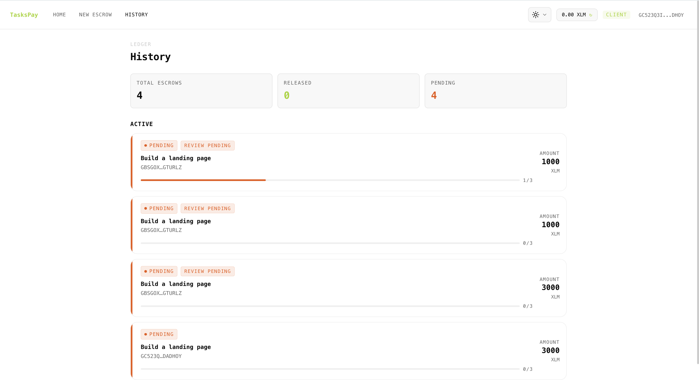
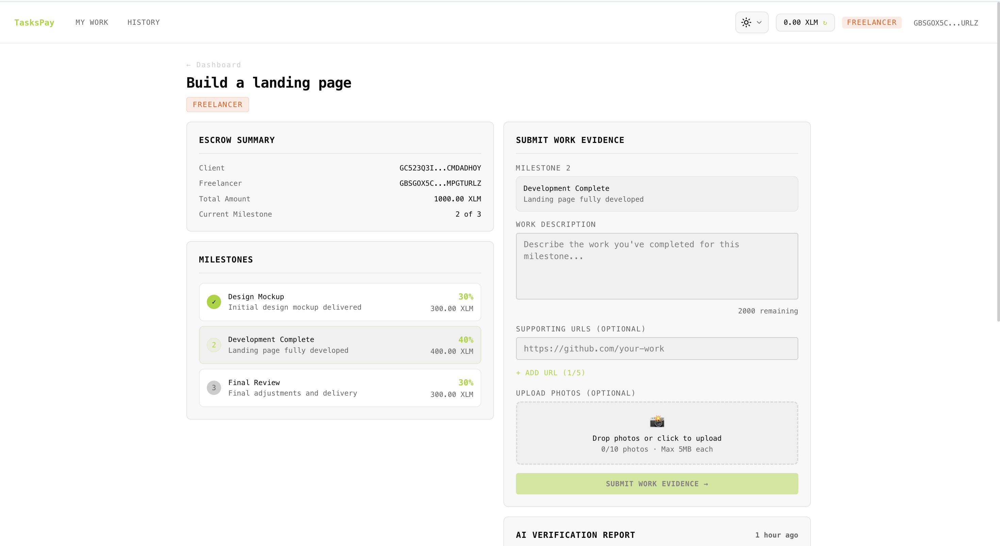
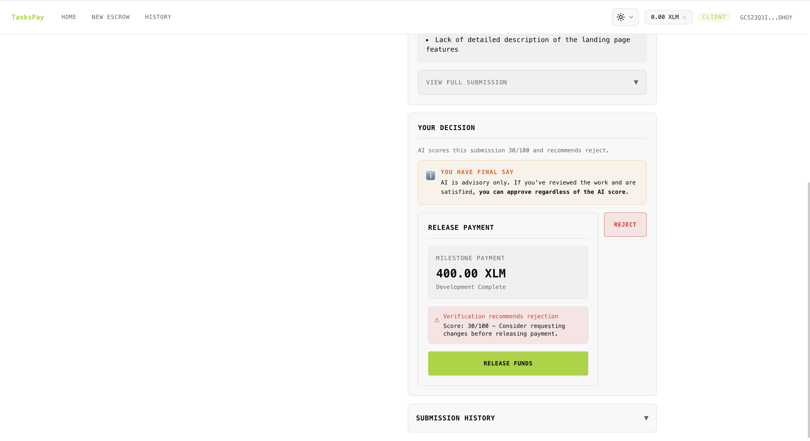
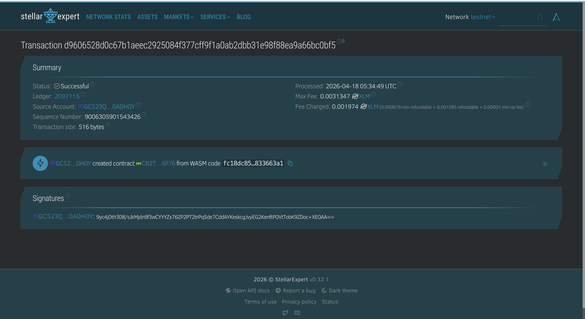

# Taskspay

**Trustless freelance escrow on Stellar.**


Taskspay helps clients and freelancers work without trust assumptions. The client locks XLM in a Soroban smart contract, AI turns the job brief into milestones, the freelancer submits proof of work per milestone, and the client releases payment only when satisfied. Stellar handles settlement on-chain, while Supabase stores the off-chain submission history and role data.

## Why It Matters

- Freelancers do not want to chase payment after shipping work.
- Clients do not want to send the full amount before seeing delivery.
- Taskspay turns that tension into a clear milestone flow with on-chain custody and direct wallet payout.

## The Real Flow



## Who Does What

| Actor | Responsibility |
| --- | --- |
| **Client** | Creates the escrow, reviews submissions, releases funds, or refunds remaining balance |
| **Freelancer** | Completes milestone work and submits evidence for review |
| **AI** | Suggests milestone splits and scores delivery quality, but does not control funds |
| **Soroban contract** | Holds XLM in escrow and releases payment directly to the freelancer wallet |
| **Supabase** | Stores profile data, submissions, verification results, and payment history |

## Why Taskspay Stands Out

- **Real on-chain escrow**: funds are locked before work starts, not promised off-platform
- **Milestone-based payouts**: clients release only the current tranche instead of the full project amount
- **AI that assists, not decides**: GPT helps structure milestones and flags weak submissions, but the client has final say
- **No custom backend**: the frontend talks directly to Soroban RPC and Supabase
- **Direct wallet settlement**: approved funds move straight to the freelancer's Stellar address

## UI/UX Snapshot: Landing & User Flows

### Landing Page Design
The Taskspay landing page is optimized for **executive trust** and **instant clarity**. Here's the structure:

#### Hero Section
- **Headline**: "The Era of Trustless Freelance"
- **Subheading**: "Eliminate payment disputes with AI-generated milestones and automated on-chain settlements. Every deliverable is verified, every payment is guaranteed."
- **Primary CTA**: "Connect Wallet" (triggers Freighter wallet connection)
- **Secondary CTA**: "View Live Contract" (links to Stellar Expert explorer)
- **Hero Card**: Live example escrow (#492) showing 3 milestone breakdown with status:
  - ✓ Milestone 1: Wireframes (250 XLM) — Verified by OpenAI
  - ⊙ Milestone 2: Beta API (500 XLM) — Awaiting Submission
  - ○ Milestone 3: Deployment (250 XLM) — Not started

#### Features Section (Why Taskspay)
Three concise value propositions with hover effects:
1. **🤖 AI-Powered Milestones** — Describe your project. Our AI instantly breaks it into fair, achievable milestones with built-in verification criteria.
2. **🔒 On-Chain Settlement** — XLM locked on Stellar. Zero trust required. Payments execute automatically when milestones are verified.
3. **⚡ Instant & Cheap** — 3-5 second finality. Under $0.01 per transaction. Keep 100% of your earnings—no platform cuts.

#### Call-to-Action Section
- **Headline**: "Ready to Build with Absolute Certainty?"
- **Subheading**: "Get started in minutes. Connect your wallet, describe your project, and lock funds securely on Stellar."
- **Primary CTA**: "Start Your First Escrow"
- **Secondary CTA**: "Explore on GitHub"


#### Flow 1: First-Time Client (No Wallet)
```
Landing Page
  ↓ [Connect Wallet]
Role Selection (Choose "Client")
  ↓ [Confirm]
Client Home (Overview + Dashboard)
  ↓ [New Escrow]
Create Escrow Form
  ├─ Enter freelancer address
  ├─ Enter project amount (XLM)
  ├─ Enter project brief
  └─ [Generate AI Milestones]
Review Generated Milestones
  ↓ [Create & Lock Funds]
On-Chain Transaction (Soroban)
  ↓ Escrow created + XLM locked
Client Dashboard (Escrow now visible)
```

#### Flow 2: Freelancer Submission & Client Review
```
Freelancer Views Assigned Escrow
  ↓ [Submit Work]
Submission Form
  ├─ Write description of work
  ├─ Add links to proof (GitHub, demo, etc.)
  ├─ Upload images/screenshots
  └─ [Submit]
Submission Stored + AI Verification Scores
  ↓ [Notify Client]
Client Receives Notification
  ↓ Client Reviews Submission + AI Score
Client Decision Page
  ├─ View AI verification score (0-100)
  ├─ View freelancer proof
  └─ [Release Payment] or [Request Changes]
If Released:
  ├─ Soroban contract sends XLM to freelancer wallet
  ├─ Payment recorded in history
  ├─ Move to next milestone
  └─ Repeat until completion
If Rejected:
  ├─ Freelancer notified
  ├─ Resubmit with better evidence
  └─ Back to submission
```

#### Flow 3: Project Completion & Refund
```
All Milestones Released
  ↓ Escrow balance = 0
Escrow Status: "Released"
  ↓ Archive in history

OR (if client cancels early)

Remaining XLM in Escrow
  ↓ [Refund]
On-Chain Transaction (Refund executed)
  ↓ XLM returns to client wallet
Escrow Status: "Refunded"
```


## Product Walkthrough

### Landing Page (Redesigned)

The landing page showcases the trustless escrow concept with a premium, animated design:

<p align="center">
  
</p>

**Hero Section**: "The Era of Trustless Freelance" headline with value proposition and dual CTAs (Connect Wallet, View Live Contract). Interactive escrow example card showing milestone breakdown.

<p align="center">
  
</p>

**Features Section**: Three core value propositions with hover effects:
- 🤖 **AI-Powered Milestones** — Instant breakdown of projects into fair, achievable milestones
- 🔒 **On-Chain Settlement** — XLM locked on Stellar with automatic verification-based payouts
- ⚡ **Instant & Cheap** — 3-5 second finality, under $0.01 per transaction, zero platform fees

<p align="center">
  
</p>

**CTA Section**: "Ready to Build with Absolute Certainty?" with dual action buttons (Start Escrow, Explore GitHub) and footer links to Explorer, GitHub, and Stellar.

### Application Flows

<p align="center">
  
  
</p>

Landing and onboarding: connect Freighter, choose a role, and enter the app with wallet-based identity.

<p align="center">
  
  
</p>

Client workflow: describe the job, generate milestones with AI, lock funds in escrow, and track active deals in one place.

<p align="center">
  
  
</p>

Delivery workflow: the freelancer submits proof, AI highlights gaps, and the client either releases the milestone payment or asks for changes.

## Live Contract

- Network: `Stellar Testnet`
- Contract ID: `CDQFDOAZ5HJISBN6BPNET573F4J7FLIVFPBKBNUJZBEWVMD7XAVAV3Z3`
- Explorer: [stellar.expert](https://stellar.expert/explorer/testnet/contract/CDQFDOAZ5HJISBN6BPNET573F4J7FLIVFPBKBNUJZBEWVMD7XAVAV3Z3)

### On-Chain Proof

<p align="center">
  
</p>

The contract is deployed on Stellar Testnet and publicly verifiable through Stellar Expert, making the escrow layer transparent and auditable.

## Architecture

```text
React + Vite frontend
├── Freighter wallet connect + signing
├── Soroban RPC transaction building and submission
├── OpenAI milestone generation and delivery verification
└── Supabase auth, tables, storage, and realtime

Soroban escrow contract
├── initialize(token)
├── create_escrow(client, freelancer, amount, total_milestones)
├── release_funds(escrow_id, caller)
└── refund(escrow_id, caller)
```

The app has no custom backend. The frontend talks directly to Soroban RPC and Supabase.

## Project Structure

```text
Taskspay/
├── contract/             # Soroban escrow contract in Rust
├── frontend/             # React + Vite application
├── supabase/migrations/  # Database schema and RLS policies
├── scripts/              # Network setup and troubleshooting helpers
└── docs/screenshots/     # README product screenshots
```

## Local Setup

### Prerequisites

- Node.js 18+
- Rust
- `wasm32-unknown-unknown` target via `rustup target add wasm32-unknown-unknown`
- Stellar CLI
- Freighter wallet on Testnet
- Supabase project
- OpenAI API key

### 1. Clone and install

```bash
git clone https://github.com/JohnCarl-30/Taskspay.git
cd Taskspay/frontend
npm install
```

### 2. Wrap native XLM as a Stellar Asset Contract

```bash
cd ..
bash scripts/wrap-native-xlm.sh
```

This prints the value you must use for `VITE_XLM_TOKEN_ADDRESS`.

### 3. Configure `frontend/.env`

```env
VITE_STELLAR_RPC_URL=https://soroban-testnet.stellar.org
VITE_CONTRACT_ID=CDQFDOAZ5HJISBN6BPNET573F4J7FLIVFPBKBNUJZBEWVMD7XAVAV3Z3
VITE_XLM_TOKEN_ADDRESS=<output from wrap-native-xlm.sh>
VITE_SUPABASE_URL=https://<your-project>.supabase.co
VITE_SUPABASE_ANON_KEY=<your-anon-key>
VITE_OPENAI_API_KEY=<your-openai-api-key>
```

### 4. Apply Supabase migrations

Run every SQL file in [`supabase/migrations/`](./supabase/migrations/) in numeric order using the Supabase SQL Editor, then enable **Anonymous Sign-In** in Supabase Auth.

### 5. Fund a testnet wallet

Use Friendbot with your Freighter public key:

```text
https://friendbot.stellar.org?addr=<your-public-key>
```

### 6. Run the app

```bash
cd frontend
npm run dev
```

Open `http://localhost:5173`, connect Freighter, and initialize the contract once before creating your first escrow.

## Development

```bash
# frontend
cd frontend
npm run dev
npm run build
npm run lint
npm test

# contract
cd contract
cargo test
soroban contract build
```

## Important Notes

- `VITE_XLM_TOKEN_ADDRESS` is required. The app intentionally does not fall back to a hardcoded token address.
- Native XLM must be wrapped before `initialize` succeeds.
- Vite reads `.env` only on startup, so restart `npm run dev` after changing environment variables.
- On-chain amounts are encoded in stroops.
- AI verification is advisory only. The client makes the final decision.

## License

MIT. See [LICENSE](./LICENSE).
