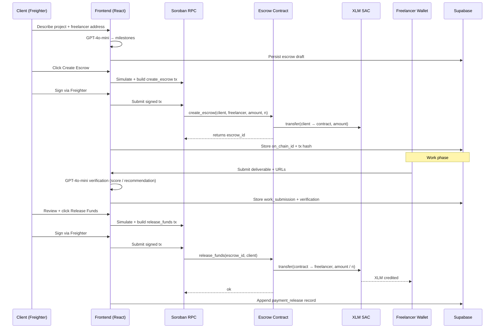

# Taskspay

**AI-powered freelance escrow on Stellar.**

Clients lock XLM in a Soroban smart contract, AI generates milestone breakdowns from a plain-English project description, and the contract releases funds to the freelancer automatically as each milestone is approved. Settlement in 3–5 seconds. Fees under $0.01. No intermediaries.

---

## Live Contract

| | |
|---|---|
| **Network** | Stellar Testnet |
| **Contract ID** | `CDQFDOAZ5HJISBN6BPNET573F4J7FLIVFPBKBNUJZBEWVMD7XAVAV3Z3` |
| **Explorer** | https://stellar.expert/explorer/testnet/contract/CDQFDOAZ5HJISBN6BPNET573F4J7FLIVFPBKBNUJZBEWVMD7XAVAV3Z3 |

---

## Table of Contents

- [Quick Setup (5 minutes)](#quick-setup-5-minutes)
- [Troubleshooting](#troubleshooting)
- [End-to-End Flow](#end-to-end-flow)
- [Release-Funds Data Flow](#release-funds-data-flow)
- [Architecture](#architecture)
- [Smart Contract](#smart-contract)
- [Database Schema](#database-schema)
- [Development](#development)
- [Key Source Files](#key-source-files)
- [AI Integration](#ai-integration)
- [Why Stellar](#why-stellar)

---

## Quick Setup (5 minutes)

This is the only setup path you need. Follow in order.

### 1. Prerequisites

- **Node.js 18+**
- **Rust** (stable) with `rustup target add wasm32-unknown-unknown`
- **Stellar CLI** — install via https://developers.stellar.org/docs/tools/cli/install-cli (verify with `stellar --version`)
- **Freighter wallet** browser extension — https://www.freighter.app/ (switch it to **Testnet** in the extension menu)
- A **Supabase** project (free tier is fine)
- An **OpenAI API key**

### 2. Clone and install

```bash
git clone https://github.com/your-repo/taskspay.git
cd taskspay/frontend
npm install
```

### 3. Wrap the native XLM SAC (fixes the "Unsupported address type" error)

The escrow contract transfers XLM through a Stellar Asset Contract. The native XLM SAC must be wrapped on testnet before the contract can initialize:

```bash
cd ..
bash scripts/wrap-native-xlm.sh
```

This generates and funds a `deployer` key if needed, then prints the SAC contract ID. See [XLM_TOKEN_SETUP.md](XLM_TOKEN_SETUP.md) for detail and troubleshooting.

### 4. Configure `frontend/.env`

Create `frontend/.env`:

```env
VITE_STELLAR_RPC_URL=https://soroban-testnet.stellar.org
VITE_CONTRACT_ID=CDQFDOAZ5HJISBN6BPNET573F4J7FLIVFPBKBNUJZBEWVMD7XAVAV3Z3
VITE_XLM_TOKEN_ADDRESS=<paste the SAC ID from step 3>
VITE_SUPABASE_URL=https://<your-project>.supabase.co
VITE_SUPABASE_ANON_KEY=<your-anon-key>
VITE_OPENAI_API_KEY=sk-...
```

### 5. Apply Supabase migrations

In the Supabase dashboard → **SQL Editor**, run each file from [supabase/migrations/](supabase/migrations/) in numeric order:

```
001_initial_schema.sql
002_work_submissions.sql
003_delivery_verifications.sql
004_payment_releases.sql
005_add_on_chain_id_to_escrows.sql
006_add_client_decision_to_work_submissions.sql
```

Enable **Anonymous Sign-In** under **Authentication → Providers**.

### 6. Fund a testnet wallet

- Open Freighter, copy your public key (`G…`).
- Fund it via Friendbot: `https://friendbot.stellar.org?addr=<your-public-key>`.

### 7. Run the app

```bash
cd frontend
npm run dev
# http://localhost:5173
```

Connect Freighter (top-right), click **Initialize Contract** once, then create your first escrow.

---

## Troubleshooting

| Symptom | Cause | Fix |
|---|---|---|
| `Unsupported address type: CD…` on Initialize | Native XLM SAC not wrapped on this network | Run `bash scripts/wrap-native-xlm.sh`, paste the output into `VITE_XLM_TOKEN_ADDRESS`, restart `npm run dev` |
| `VITE_XLM_TOKEN_ADDRESS is not set` banner | `.env` missing the SAC ID | Same as above |
| `Contract not initialized` on Release Funds | Initialize tx never landed | Retry Initialize from the dashboard; confirm tx on stellar.expert |
| Freighter says "wrong network" | Extension set to Mainnet | Open Freighter → settings → switch to Testnet |
| `Access restricted — wrong wallet connected` on escrow detail | Connected wallet is neither the escrow's client nor freelancer | Reconnect with the correct key |
| `sb_publishable_...` placeholder fails | Supabase env keys not set | Paste real values from Supabase → Project Settings → API |
| AI milestone generation times out | OpenAI key missing or rate-limited | Check `VITE_OPENAI_API_KEY`, look at the browser console for the exact error |

---

## End-to-End Flow



---

## Release-Funds Data Flow

This is the exact chain that credits the freelancer's Freighter wallet — no manual step, no off-chain bridge:

1. **Client clicks "Release Funds"** in [frontend/src/components/ReleaseFundsButton.tsx](frontend/src/components/ReleaseFundsButton.tsx).
2. Frontend calls `releaseFunds(client, escrow_id, signTransaction)` in [frontend/src/stellar.ts](frontend/src/stellar.ts).
3. Tx simulates against Soroban RPC, is signed by Freighter, and submitted.
4. Contract entrypoint `release_funds` runs in [contract/src/lib.rs](contract/src/lib.rs):
   - Verifies caller is the client.
   - Increments `completed_milestones`.
   - Computes `per_milestone = amount / total_milestones`.
   - Calls `token.transfer(contract → escrow.freelancer, per_milestone)` against the native XLM SAC.
5. The SAC credits the freelancer's account — **this is the moment their Freighter balance updates.**
6. Frontend writes a `payment_releases` record to Supabase for UI history.

The freelancer's Stellar address was captured at `create_escrow` time and stored on-chain in the `Escrow` struct. The client never has to re-enter it — the contract always sends to that stored address.

---

## Architecture

```
Browser (React 19 + Vite + TypeScript)
    │
    ├── @stellar/freighter-api    Wallet connect + tx signing
    ├── @stellar/stellar-sdk      Build / simulate / submit Soroban txs
    ├── @supabase/supabase-js     Off-chain state, realtime, anon auth
    └── openai                    Milestone generation + delivery verification
         │
         ▼
Stellar Testnet (Soroban RPC)
    ├── Taskspay Escrow Contract  Locks XLM, releases per milestone, refunds
    └── Native XLM SAC            Token contract for transfers
         │
         ▼
Supabase (Postgres + Realtime + Anon Auth)
    ├── escrows                   Mirrors on-chain state + milestone metadata
    ├── work_submissions          Freelancer deliverables per milestone
    ├── delivery_verifications    AI analysis (score, recommendation, gaps)
    └── payment_releases          Append-only log of on-chain releases
```

**No backend server.** The React frontend talks directly to Soroban RPC and Supabase. Auth is wallet-scoped anonymous via Supabase.

---

## Smart Contract

**File:** [contract/src/lib.rs](contract/src/lib.rs)

| Function | Caller | What it does |
|---|---|---|
| `initialize(token)` | Anyone (once) | Stores the XLM SAC address |
| `is_initialized()` | Anyone (view) | Returns whether the contract has a token set |
| `create_escrow(client, freelancer, amount, n)` | Client | Locks XLM in the contract; returns `u64` escrow ID |
| `release_funds(escrow_id, client)` | Client | Transfers `amount / n` XLM to the freelancer |
| `refund(escrow_id, client)` | Client | Returns remaining locked XLM to the client |
| `get_escrow(escrow_id)` | View | Reads escrow state |
| `get_client_escrows(client)` | View | All escrows where `client == caller` |
| `get_freelancer_escrows(freelancer)` | View | All escrows where `freelancer == caller` |

### State machine

```
create_escrow()
      │
      ▼
   Active ──── release_funds() ──▶ (per-milestone; repeats until all n released)
      │                                             │
      │                                             ▼
      │                                         Released
      │
      └──────── refund() ──────▶ Refunded
```

### Amount encoding

XLM is stored in **stroops** (1 XLM = 10,000,000 stroops) as `i128`:

```typescript
const amountStroops = BigInt(Math.round(parseFloat(amountXLM) * 10_000_000));
```

---

## Database Schema

RLS is enabled on every table via Supabase anonymous auth.

### `escrows`

| Column | Type | Description |
|---|---|---|
| `id` | UUID | Primary key |
| `user_id` | UUID | Supabase auth user (creator) |
| `wallet_address` | TEXT | Client's Stellar address |
| `freelancer_address` | TEXT | Freelancer's Stellar address |
| `amount` | NUMERIC(20,7) | Total XLM |
| `description` | TEXT | Project description |
| `milestone_count` | INT | Number of milestones |
| `milestones` | JSONB | `[{name, description, percentage, xlm}]` |
| `tx_hash` | TEXT | `create_escrow` transaction hash |
| `status` | TEXT | `pending | active | completed | refunded` |
| `on_chain_id` | BIGINT | `u64` ID returned by the contract |
| `payment_releases` | JSONB | `[{milestone_index, released_at, tx_hash, score}]` |
| `verification_result` | JSONB | AI pre-flight check of the description |

### `work_submissions`

| Column | Type | Description |
|---|---|---|
| `id` | UUID | Primary key |
| `escrow_id` | UUID | FK → escrows |
| `milestone_index` | INT | 0-indexed |
| `submitter_address` | TEXT | Freelancer's Stellar address |
| `description` | TEXT | Work description (≤ 2000 chars) |
| `urls` | TEXT[] | Supporting links (≤ 5) |
| `client_decision` | TEXT | `accepted | rejected | null` |

### `delivery_verifications`

| Column | Type | Description |
|---|---|---|
| `id` | UUID | Primary key |
| `submission_id` | UUID | FK → work_submissions |
| `score` | INT | 0–100 quality score |
| `recommendation` | TEXT | `approve | request_changes | reject` |
| `feedback` | TEXT | Plain-English explanation |
| `gaps` | TEXT[] | Missing items identified by AI |
| `raw_response` | JSONB | Full OpenAI response |

---

## Development

```bash
# Frontend
cd frontend
npm run dev          # http://localhost:5173
npm run build        # TypeScript check + production build
npm run lint         # ESLint
npm test             # Vitest watch mode
npx vitest run <f>   # Single test file

# Smart contract
cd contract
cargo test                  # Unit tests
soroban contract build      # Produces target/wasm32-unknown-unknown/release/taskspay.wasm

# Deploy your own contract (optional)
soroban keys generate deployer --network testnet --fund
soroban contract deploy \
  --wasm target/wasm32-unknown-unknown/release/taskspay.wasm \
  --source deployer \
  --network testnet
# Paste the printed contract ID into VITE_CONTRACT_ID in frontend/.env
```

---

## Key Source Files

| File | Purpose |
|---|---|
| [frontend/src/stellar.ts](frontend/src/stellar.ts) | Soroban tx builders: `initializeContract`, `createEscrow`, `releaseFunds`, `refundEscrow` |
| [frontend/src/freighter.ts](frontend/src/freighter.ts) | Freighter: connect, sign, get address |
| [frontend/src/supabase.ts](frontend/src/supabase.ts) | Supabase client, TS types, DB helpers |
| [frontend/src/openai.ts](frontend/src/openai.ts) | Milestone generation (GPT-4o-mini) |
| [frontend/src/verification.ts](frontend/src/verification.ts) | AI delivery verification |
| [frontend/src/pages/HomePage.tsx](frontend/src/pages/HomePage.tsx) | Landing hero + client dashboard |
| [frontend/src/pages/EscrowDetailPage.tsx](frontend/src/pages/EscrowDetailPage.tsx) | Role-based client/freelancer view |
| [frontend/src/components/ReleaseFundsButton.tsx](frontend/src/components/ReleaseFundsButton.tsx) | Confirm → sign → submit state machine |
| [contract/src/lib.rs](contract/src/lib.rs) | Soroban escrow contract |
| [scripts/wrap-native-xlm.sh](scripts/wrap-native-xlm.sh) | One-shot native XLM SAC deploy helper |

---

## AI Integration

### Milestone generation ([openai.ts](frontend/src/openai.ts))

GPT-4o-mini takes the client's project description and returns 3–5 milestones with:
- Name
- Deliverable description
- Payment percentage
- Calculated XLM amount

### Delivery verification ([verification.ts](frontend/src/verification.ts))

When the freelancer submits work, GPT-4o-mini scores it against the milestone requirement:

| Field | Values |
|---|---|
| `score` | 0–100 |
| `recommendation` | `approve` / `request_changes` / `reject` |
| `feedback` | Plain-English explanation |
| `gaps` | Specific missing items |

The AI result is **informational only** — the client always makes the final decision.

---

## Role-Based Access

The app matches the connected wallet against the escrow record:

| Match | Role | Can do |
|---|---|---|
| `wallet_address` (creator) | **Client** | Review, Accept (release), Reject, Refund |
| `freelancer_address` | **Freelancer** | Submit work evidence |
| Neither | **Viewer** | Read-only, cannot interact |

---

## Why Stellar

| Factor | Detail |
|---|---|
| **Fees** | Sub-cent per tx (PayPal: 2.9% + $0.30) |
| **Finality** | 3–5 seconds (wires: 1–3 business days) |
| **Smart contracts** | Soroban enables trustless escrow without an intermediary |
| **Composability** | Same contract works for any milestone-based agreement |

---

## Target Market

Filipino and SEA freelancers, designers, and developers earning $500–$5,000/month who work with overseas clients. They face frequent payment disputes, have no cross-border legal recourse, and need instant, trustless settlement. The $10B+ global freelance payments market is underserved by existing rails.

---

## License

MIT — see [LICENSE](LICENSE)
